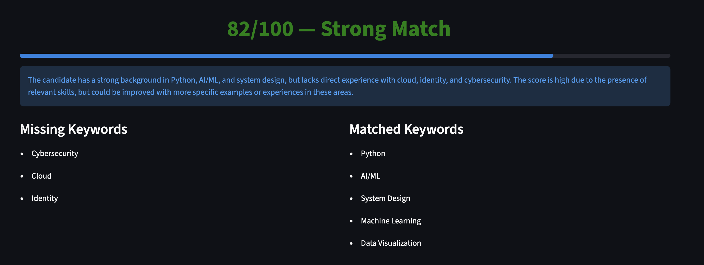
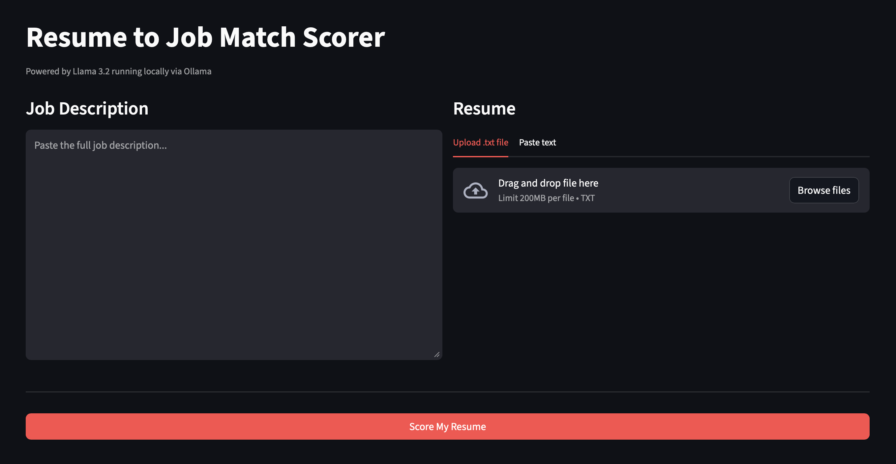

# Resume to Job Match Scorer

A local, privacy first tool that compares your resume against a job description and returns a match score, missing keywords, and matched skills. Everything runs on your machine with no data sent to any external API.

## Demo




## How it works

Paste a job description, upload or paste your resume, and hit **Score My Resume**. Llama 3.2 runs locally via Ollama to analyze the gap between your resume and the role.

## Setup

**1. Install Ollama and pull the model**
```bash
brew install ollama
ollama pull llama3.2
```

**2. Install Python dependencies**
```bash
pip install -r requirements.txt
```

**3. Run**
```bash
streamlit run app.py
```

The app opens at http://localhost:8501. Ollama must be running in the background (`ollama serve`).

## Stack

* Streamlit — UI
* Ollama — local LLM runtime
* Llama 3.2 — scoring model
* Python 3.9+
